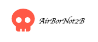

# AirBorNot2B

A literature inspired, soft clone of rental company AirBnB's site. 

## Launching

### Through Render:

Head to the live deployment link: [https://airbnb-api-project-5lbs.onrender.com]

### Locally:

Run `npm install` in the `backend` folder.

Using the `env.example` file, create a `.env` file containing all the necessary information

Run the sequelize commands to populate the database: `npx dotenv sequelize db:migrate && npx dotenv sequelize db:seed:all`

Run `npm start` to start the backend server.

Head into the `frontend` folder and run `npm install`

Run `npm start` to start the fronend server.

Now you should be redirected to a localhost:3000 page containing the project. 

